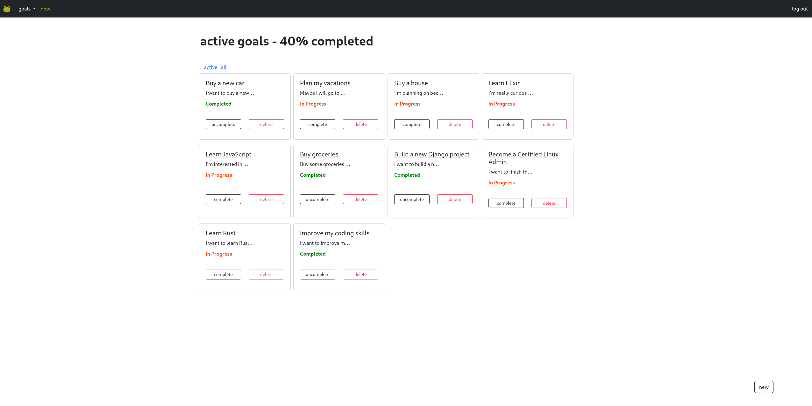

# Gorg
A task manager. It was done as a toy project in order to learn some Django, HTML and CSS (Bootstrap).

# Features
- Create, retrieve, update and delete daily, weekly, monthly and yearly goals.
- The goals expire automatically if they are not completed in due date.
- See the percentage of completed goals for a given timespan.
- User management system.
